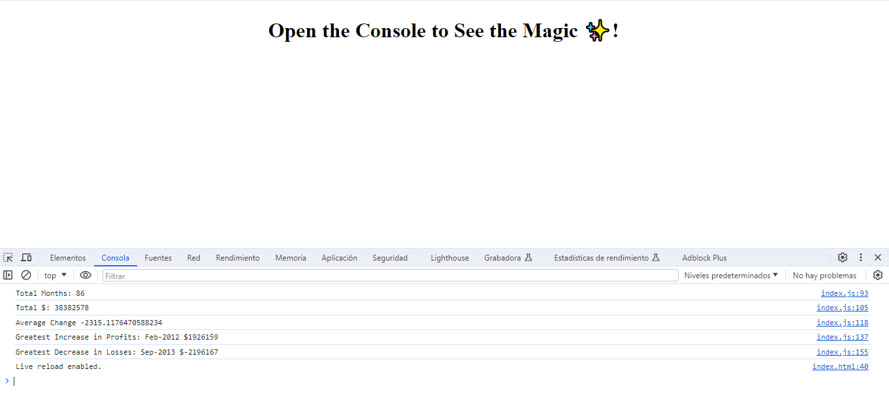

# Financial Analysis Console

## Description

With a given dataset composed of arrays with two fields: Date and Profit/Losses, I have created a code that analyses the records to calculate each of the following:

* The total number of months included in the dataset.

* The net total amount of Profit/Losses over the entire period.

* The average of the changes in Profit/Losses over the entire period.

* The greatest increase in profits (date and difference in the amounts) over the entire period.

* The greatest decrease in losses (date and difference in the amounts) over the entire period.

## Usage

